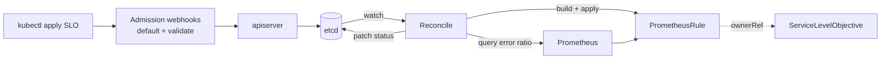

# SLO Operator

A Kubernetes operator that turns **Service Level Objectives** into native Kubernetes
resources. Declare an SLO once, and the operator generates the Prometheus alerting
rules, continuously evaluates the error budget, and reports the result in the
resource status.

> Status: work in progress. The core is functional end to end (rule generation +
> budget evaluation + admission webhooks). See the [roadmap](#roadmap).

---

## What it does

For every `ServiceLevelObjective` you apply, the operator:

1. **Generates a `PrometheusRule`** containing
   - recording rules for the SLI error ratio across every burn-rate window, and
   - **multi-window, multi-burn-rate** alerts following the
     [Google SRE Workbook](https://sre.google/workbook/alerting-on-slos/).
2. **Evaluates the error budget** by querying Prometheus, and writes the remaining
   budget, the current burn rate and a health phase to the status.
3. **Validates and defaults** every SLO through admission webhooks, so a broken spec
   is rejected before it reaches the cluster.



---

## The `ServiceLevelObjective` resource

```yaml
apiVersion: sre.slo.romanmasson.dev/v1alpha1
kind: ServiceLevelObjective
metadata:
  name: checkout-availability
  namespace: shop
spec:
  description: "Checkout API availability"
  objective: "99.9"        # target in percent, kept as a string for precision
  window: 30d              # rolling compliance window (Prometheus duration)
  sli:
    type: availability     # availability | latency
    totalQuery: sum(rate(http_requests_total{service="checkout"}[{{.Window}}]))
    errorQuery: sum(rate(http_requests_total{service="checkout",code=~"5.."}[{{.Window}}]))
```

### Spec fields

| Field | Required | Description |
|---|---|---|
| `objective` | ✅ | Target in percent, e.g. `"99.9"`. String to avoid float rounding. Must be in `(0, 100)`. |
| `window` | | Rolling window (default `30d`). Any valid Prometheus duration. |
| `sli.type` | ✅ | `availability` or `latency`. Immutable after creation. |
| `sli.totalQuery` | ✅ | PromQL for the denominator (all events). May contain `{{.Window}}`. |
| `sli.errorQuery` | ✅ | PromQL for the numerator (bad events). May contain `{{.Window}}`. |
| `enforcement` | | *(planned)* Freeze deployments when the budget is exhausted. |

The `{{.Window}}` placeholder is substituted per burn-rate window when the operator
generates the recording rules.

### Status

`kubectl get slo` surfaces the key columns:

```
NAME                   OBJECTIVE   WINDOW   BUDGET-REMAINING   PHASE     AGE
checkout-availability  99.9        30d      87.30              Healthy   2d
```

| Field | Meaning |
|---|---|
| `errorBudgetRemaining` | Remaining error budget in percent (0–100). |
| `currentBurnRate` | How many times faster than nominal the budget is being spent. |
| `phase` | `Healthy` (>25% left), `Warning` (≤25%), `Exhausted` (≤0%), `Unknown` (Prometheus unreachable). |
| `conditions` | `Ready`, `RulesGenerated`, `PrometheusReachable`, `BudgetHealthy`. |

---

## How burn-rate alerting works

The error budget is what you're allowed to fail: a 99.9% objective over 30 days
allows ~43 minutes of downtime per month. The **burn rate** is how fast you spend it
(1 = spend it exactly over the window; 14.4 = spend it all in ~2 days).

Each alert combines a **long** window (confirms the problem is real) and a **short**
window (clears the alert quickly once fixed). Both must exceed `burnRate × budget`:

| Severity | Short window | Long window | Burn rate | Budget spent to fire |
|---|---|---|---|---|
| critical (page) | 5m | 1h | 14.4 | 2% in 1h |
| critical (page) | 30m | 6h | 6 | 5% in 6h |
| warning (ticket) | 2h | 1d | 3 | 10% in 1d |
| warning (ticket) | 6h | 3d | 1 | 10% in 3d |

These factors are calibrated for a 30-day window (Google SRE Workbook).

---

## Getting started (development)

Prerequisites: Go 1.26, `make`, and (for integration tests) the envtest binaries.

```bash
# Run all unit + integration tests (downloads envtest binaries on first run)
make test

# Run the operator locally against your current kubecontext
make run
# ...or point it at a specific Prometheus:
go run ./cmd/main.go --prometheus-url=http://localhost:9090

# Install the CRD into the cluster
make install
```

The operator reads Prometheus at `--prometheus-url`
(default `http://kube-prometheus-stack-prometheus.monitoring.svc:9090`).

### Fast iteration (no cluster needed)

The core logic is pure and testable without a cluster:

```bash
go test ./internal/rules/...                        # rule generation (golden tests)
go test ./internal/controller/ -run TestReconcile   # reconcile logic (fake client)
go test ./internal/webhook/...                      # validation logic
```

---

## Project layout

```
api/v1alpha1/            API types (Spec/Status) + phase & condition constants
internal/rules/          Pure SLO -> PrometheusRule generation (+ golden tests)
internal/promclient/     Thin, mockable Prometheus client (PromAPI interface)
internal/controller/     Reconcile loop + budget/phase computation
internal/webhook/        Defaulting + validating admission webhooks
cmd/main.go              Wiring: flags, scheme, controller, webhooks
```

Design principle: **isolate the pure logic, test it without a cluster, and keep only
orchestration in the controller.**

---

## Roadmap

- [x] API types + CRD (Spec/Status, printer columns, short name `slo`)
- [x] `PrometheusRule` generation (recording rules + burn-rate alerts)
- [x] Apply the rule from the reconcile loop (owner reference, idempotent)
- [x] Error-budget evaluation from Prometheus (budget %, burn rate, phase, events)
- [x] Admission webhooks (defaulting + validation, PromQL parsing, immutability)
- [ ] Enforcement: freeze Deployments when the budget is exhausted
- [ ] CI (lint + test + build) and multi-arch release image
- [ ] End-to-end tests on kind + quickstart

---

## License

Apache-2.0.
