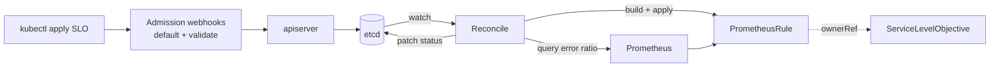

# SLO Operator

[](https://github.com/RomanMasson1505/SLO-Custom-Ressource/actions/workflows/lint.yml)
[](https://github.com/RomanMasson1505/SLO-Custom-Ressource/actions/workflows/test.yml)

Declare Service Level Objectives as native Kubernetes resources. The operator
generates the Prometheus alerting rules, continuously tracks the error budget, and
surfaces it in the resource status — so `kubectl get slo` tells you, per service,
how much reliability budget is left and how fast it is burning.

## The problem

Teams agree on SLOs — *"99.9% of checkout requests succeed over 30 days"* — but
turning that into working monitoring is manual and repetitive: recording rules,
multi-window burn-rate alerts, and hand-computed thresholds, rewritten for every
service. And once deployed, nothing tracks the remaining **error budget** as
first-class, queryable cluster state.

## The solution

A Kubernetes operator (custom resource + controller). You write a single
`ServiceLevelObjective`; the operator then:

- generates a `PrometheusRule` with recording rules and multi-window burn-rate alerts;
- queries Prometheus each cycle to compute the remaining budget, burn rate and health
  phase, and writes them back to the resource status;
- validates every SLO through admission webhooks *before* it is stored;
- optionally freezes deployments when a budget is exhausted.

One operator handles any number of SLOs — adding a service is a single `kubectl apply`.

## Method: multi-window burn-rate alerting

The error budget is what you are allowed to fail: 99.9% over 30 days permits about
43 minutes of downtime per month. The **burn rate** is how fast you spend it — `1`
means you would spend the whole budget exactly over the window, `14.4` means you
spend it in ~2 days.

Following the [Google SRE Workbook](https://sre.google/workbook/alerting-on-slos/),
each alert pairs a **long** window (confirms the problem is real) with a **short**
one (clears the alert quickly once fixed); both must exceed `burn rate × budget`:

| Severity | Short window | Long window | Burn rate | Fires after |
|---|---|---|---|---|
| critical (page) | 5m | 1h | 14.4 | 2% of budget in 1h |
| critical (page) | 30m | 6h | 6 | 5% of budget in 6h |
| warning (ticket) | 2h | 1d | 3 | 10% of budget in 1d |
| warning (ticket) | 6h | 3d | 1 | 10% of budget in 3d |

## How it reconciles



Each `PrometheusRule` carries an owner reference back to its SLO, so it is garbage
collected automatically when the SLO is deleted, and the controller self-heals it if
it drifts. The loop is idempotent and re-evaluates every 60 seconds.

## Stack

- **Go**, **Kubebuilder** / controller-runtime
- **prometheus-operator** CRDs (`PrometheusRule`, `ServiceMonitor`)
- Prometheus HTTP client, with SLI queries validated by Prometheus' own **PromQL parser**
- **cert-manager** for webhook TLS
- **envtest** integration tests, **golangci-lint**, **GitHub Actions** CI, **Helm** chart for distribution

## The `ServiceLevelObjective` resource

```yaml
apiVersion: sre.slo.romanmasson.dev/v1alpha1
kind: ServiceLevelObjective
metadata:
  name: checkout-availability
  namespace: shop
spec:
  description: "Checkout API availability"
  objective: "99.9"        # target percentage (string, to avoid float rounding)
  window: 30d              # rolling compliance window (Prometheus duration)
  sli:
    type: availability     # availability | latency
    totalQuery: sum(rate(http_requests_total{service="checkout"}[{{.Window}}]))
    errorQuery: sum(rate(http_requests_total{service="checkout",code=~"5.."}[{{.Window}}]))
```

| Field | Required | Description |
|---|---|---|
| `objective` | yes | Target percentage, e.g. `"99.9"`. Must be in `(0, 100)`. |
| `window` | no | Rolling window (default `30d`); any valid Prometheus duration. |
| `sli.type` | yes | `availability` or `latency`. Immutable after creation. |
| `sli.totalQuery` | yes | PromQL denominator (all events). May contain `{{.Window}}`. |
| `sli.errorQuery` | yes | PromQL numerator (bad events). May contain `{{.Window}}`. |
| `enforcement` | no | Opt-in deployment freeze once the budget is exhausted (see below). |

The controller substitutes `{{.Window}}` per burn-rate window when generating the
rules. Status is exposed as printer columns:

```
NAME                   OBJECTIVE   WINDOW   BUDGET-REMAINING   PHASE     AGE
checkout-availability  99.9        30d      87.30              Healthy   2d
```

`phase` is `Healthy` (>25% budget left), `Warning` (≤25%), `Exhausted` (≤0%), or
`Unknown` (Prometheus unreachable), alongside `Ready`, `RulesGenerated`,
`PrometheusReachable` and `BudgetHealthy` conditions.

## Enforcement (optional)

When `enforcement.freezeDeployments` is set and the budget reaches `Exhausted`, the
operator labels the matching Deployments with `slo.io/budget-exhausted: "true"` (and
removes it when the budget recovers):

```yaml
spec:
  enforcement:
    freezeDeployments: true
    selector:
      matchLabels: { app: checkout }
```

The operator only *sets the label*; what that label means is a separate policy
decision. A sample
[`ValidatingAdmissionPolicy`](config/samples/validatingadmissionpolicy_freeze.yaml)
rejects image changes on labelled Deployments — keeping *who marks* and *who blocks*
cleanly separated.

## Install

Cluster prerequisites: **cert-manager** (webhook TLS) and a **Prometheus** the
operator can reach.

The release workflow publishes a Helm chart to GHCR (OCI). Install it in one command:

```bash
helm install slo-operator \
  oci://ghcr.io/romanmasson1505/charts/slo-custom-ressource --version 0.1.0 \
  --namespace slo-system --create-namespace
```

Everything is configurable via [`dist/chart/values.yaml`](dist/chart/values.yaml)
(image, replicas, `--prometheus-url`, whether to install the CRD…). To install from a
clone instead: `helm install slo-operator ./dist/chart -n slo-system --create-namespace`.

### Try it locally, end to end

```bash
minikube start --cpus=2 --memory=3600

# cert-manager + Prometheus (grafana/alertmanager off to stay light)
kubectl apply -f https://github.com/cert-manager/cert-manager/releases/download/v1.16.2/cert-manager.yaml
helm repo add prometheus-community https://prometheus-community.github.io/helm-charts && helm repo update
helm install kps prometheus-community/kube-prometheus-stack -n monitoring --create-namespace \
  --set prometheus.prometheusSpec.ruleSelectorNilUsesHelmValues=false \
  --set prometheus.prometheusSpec.serviceMonitorSelectorNilUsesHelmValues=false \
  --set grafana.enabled=false --set alertmanager.enabled=false

# a demo app that exposes a metric, then the operator and a SLO
kubectl apply -f hack/e2e/demo-app.yaml
make install && make docker-build IMG=slo-operator:dev && minikube image load slo-operator:dev
make deploy IMG=slo-operator:dev
kubectl apply -f hack/e2e/slo.yaml

kubectl get slo -n demo        # PHASE Healthy, BUDGET-REMAINING ~100
```

To watch enforcement, drive up the error rate and observe the budget drain:

```bash
kubectl port-forward -n demo svc/checkout 8080:8080 &
curl "localhost:8080/set-errors?n=5"                # ~33% errors
kubectl get slo -n demo -w                          # ~1-2 min -> Exhausted
kubectl get deploy checkout -n demo --show-labels   # slo.io/budget-exhausted=true
```

## Development

```bash
make test                                           # unit + envtest integration
go test ./internal/rules/...                        # rule generation (golden tests)
go test ./internal/controller/ -run TestReconcile   # reconcile logic (fake client)
go test ./internal/webhook/...                       # validation logic
```

```
api/v1alpha1/         API types (Spec/Status) + phase & condition constants
internal/rules/       Pure SLO -> PrometheusRule generation (+ golden tests)
internal/promclient/  Thin, mockable Prometheus client (PromAPI interface)
internal/controller/  Reconcile loop + budget/phase computation
internal/webhook/     Defaulting + validating admission webhooks
```

Guiding principle: keep the logic pure and testable without a cluster, and leave only
orchestration in the controller. Coverage on the `internal` packages is ~80–92%.

## Status

`v0.1.0` — the core workflow is complete and tested. Known limitations: the
`test/e2e` suite is still the generated scaffold, and each operator instance targets
a single Prometheus endpoint.

## License

[Apache-2.0](LICENSE).
